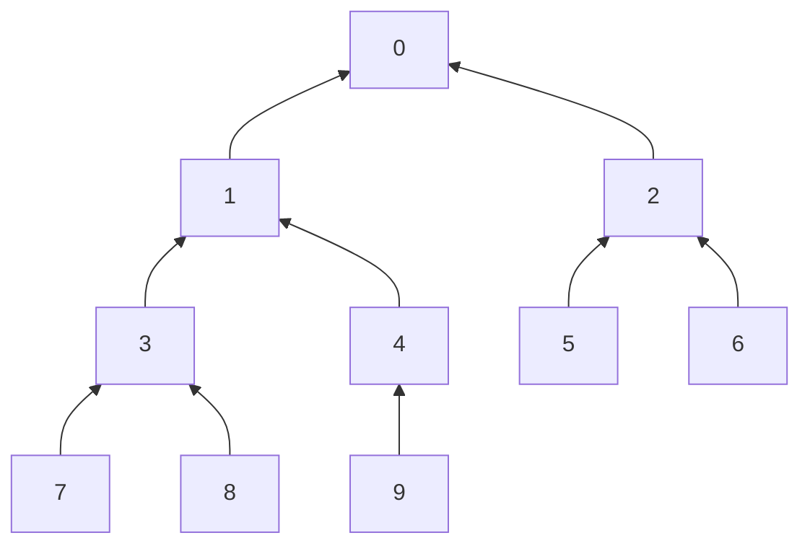

# 二叉树遍历

## 二叉树定义

二叉树的父节点最多有2个子节点，如果二叉树的所有父节点没有节点或者有2个节点，那么叫完全二叉树

## 二叉树的遍历方式

二叉树有4中遍历方式： 前序遍历， 中序， 后序， 以及层序  

前三种可以对比着看，区别在于父节点先被访问的顺序，这里的先后都是相对于同一个树而言。 这里的访问意思是访问其值， 例如打印节点的数据：  
  * 前序遍历， 先父节点，再左子节点，最后是右子节点 
  * 中序遍历， 先左子节点， 再父节点， 最后是右子节点
  * 中序遍历， 先左子节点， 再右子节点 ，最后父节点

可见，都是先左子节点后右子节点  

而层序遍历是从上往下，广度优先

## 效果

若有以下二叉树，则遍历结果


层序: 0 1 2 3 4 5 6 7 8 9


先序: <u>0</u> 1 <u>3</u> 7 8 4 9 2 5 <u>6</u>  
中序: 7 <u>3</u> 8 1 9 4 <u>0</u> 5 2 <u>6</u>  
后序: 7 8 <u>3</u> 9 4 1 5 <u>6</u> 2 <u>0</u>  

注意下划线，即036组成的一个树， 可以证实上面的总结  


## 代码实现

实现前三种遍历都有2种方式， 递归和使用stack

节点数据结构
```python
    def Node:
        self.item
        self.lchild
        self.rchild
```

### 递归实现

前序遍历
```python
def front_recursion(root: Node):
    if root is None:
        return None
    print(root.item)
    if root.lchild is not None:
        front_recursion(root.lchild)
    if root.rchild is not None:
        front_recursion(root.rchild)
```

中序遍历
```python
def Middle_recursion(root: Node):
    if root is None:
        return None
    if root.lchild is not None:
        front_recursion(root.lchild)
    print(root.item)
    if root.rchild is not None:
        front_recursion(root.rchild)
```

后序遍历
```python
def Middle_recursion(root: Node):
    if root is None:
        return None
    if root.lchild is not None:
        front_recursion(root.lchild)
    if root.rchild is not None:
        front_recursion(root.rchild)
    print(root.item)
```

### stack实现

前序遍历
```python
def Front_stack(root: Node):
    if root is None:
        return None
    
    stack = []
    Node = root
    stack.append(Node)

    while Node or stack:
        while Node:
			# 访问和入栈的顺序顺序是先父节点后左节点
            print(Node.item)
            # 父节点入栈
            stack.append(Node.lchild)
            # 深度优先，找最左节点，下个循环就是先访问父节点后左子节点
            Node = Node.lchild
        # 这里需要好好体会，父节点和左子节点已经访问过，只剩下右节点
        # 所以就是先左后右
        Node = stack.pop()
        Node = Node.rchild
```

中序遍历
```python
def Middle_stack(root: Node):
    if root is None:
        return None
    
    stack = []
    Node = root
    stack.append(Node)

    while Node or stack:
        while Node:
            # 父节点入栈
            # 左子节点入栈
            # 但都不访问，因为压栈顺序是先父后左子，到出栈的时候再访问
            stack.append(Node.lchild)
            Node = Node.lchild

        Node = stack.pop()
        # 找到最左子节点了，开始出栈，所以肯定是先出左节点， 然后再出栈之后就是父节点
        print(Node.item)
        # 最后就是右节点， 回到第一个while 继续找右子树的最左节点
        Node = Node.rchild
```

后序的stack比较复杂

还有一个比较简单的先序stack
```python
def Front_stack(root: Node):
    if root is None:
        return None

    stack = []
    stack.append(root)

    while stack:
        Node = stack.pop()
        print(Node.item)

        # stack 先进后出，所以先压右节点
        if Node.rchild is not None:
            stack.append(Node.rchild)
        
        if Node.lchild is not None:
            stack.append(Node.lchild)
```

层序遍历,是广度优先的一种方式，所以使用到queue
```python
def Layer_queue(root: Node):
    if root is None:
        return None
    
    queue = []
    queue.append(root)
    while queue:
        # 取前面的
        Node = queue.pop(0)
        print(Node.item)
        if Node.lchild is not None:
            queue.append(Node.lchild)

        if Node.rchild is not None:
            queue.append(Node.rchild)
```

### 后序栈遍历

后序遍历的顺序是先左子后右子，最后才是父节点

```python
'''
1. 同样先找到最左边的节点，父节点和左子节点入栈
2. 找到最后一个左子节点之后，判断栈顶的节点，出栈顺序是先左子后父节点，所以只需要判断右子节点的情况：
   如果栈顶节点的右子节点为空，直接打印栈顶节点。 如果栈顶节点的右子节点是上一个出栈的节点，那么说明已经访问到了右子节点，可以继续打印父节点  
   如果栈顶的右子节点不为空也不是上一个访问的节点，所以要先去访问右子树， 将右子节点入栈，退出循环，执行第一步
'''
def back_stack(self, root):
    if root is None:
        return None
    stack = []
    Tag = None
    stack.append(root)
    while stack:
        Node = stack[-1]
        while Node.lchild:
            stack.append(Node.lchild)
            Node = Node.lchild

        while stack:
            Node = stack[-1]
            if Tag == Node.rchild or Node.rchild is None:
                Node = stack.pop()
                print(Node.item)
                Tag = Node
            elif Node.rchild is not None:
                stack.append(Node.rchild)
                break

```
