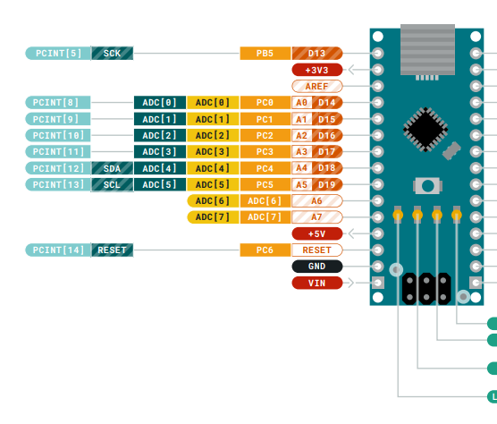
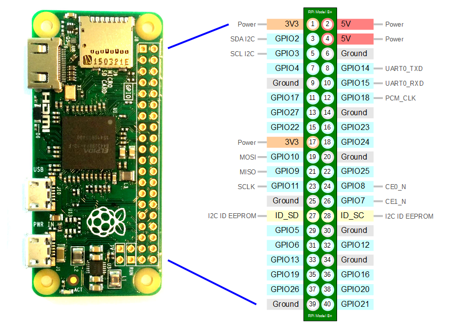

## 准备
先接线，然后启动 arduino, 最后在树莓派中验证和读写。

### 连接两个设备的GND SDA SCL
树莓派的SDA连arduino的SDA，SCL接SCL，这跟串口的接线不一样（RX接TX,TX接RX）。





### 启动arduino

arduino 从端代码，注册了i2c的地址为0x08

```c
#include <Wire.h>
#define SLAVE_ADDRESS 0x08
byte data_to_echo = 0;
void setup()
{
  Wire.begin(SLAVE_ADDRESS);
  Wire.onReceive(receiveData);
  Wire.onRequest(sendData);
}
void loop() { }
void receiveData(int bytecount)
{
  for (int i = 0; i < bytecount; i++) {
    data_to_echo = Wire.read();
  }
}
void sendData()
{
  Wire.write(data_to_echo);
}
```

### 树莓派开启i2c
进入树莓派终端执行`raspi-config` 开启I2c功能，重启后执行命令`i2cdetect -y 1`，可以看到bus上的设备。

### 树莓派的master端读写操作代码

```c
#include <linux/i2c-dev.h>
#include <i2c/smbus.h>
#include <stdint.h>
#include <stdio.h>
#include <unistd.h>
#include <fcntl.h>
#include <sys/ioctl.h>

#define DEVICE_ID 0x08
int main (int argc, char **argv) {
    // Setup I2C communication
    int fd = open("/dev/i2c-1", O_RDWR);
    if (fd == -1) {
        printf("Failed to init I2C communication.\n");
        return -1;
    }
    ioctl (fd, I2C_SLAVE, DEVICE_ID);
    printf("I2C communication successfully setup.\n");
    // Send data to arduino
    uint8_t data_to_send = 17;
    i2c_smbus_write_byte(fd, data_to_send);
    // Read data from arduino
    int received_data = i2c_smbus_read_byte(fd);
    printf("Data received: %d\n", received_data);
    if (received_data == data_to_send) {
       printf("Success!\n");
    }
    close(fd);
    return 0;
}
```

