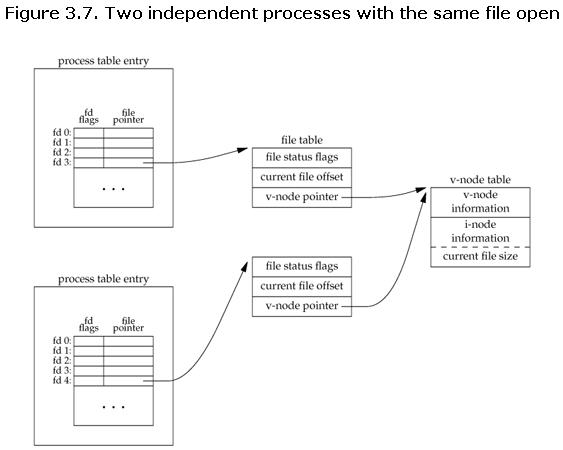

# 获取其他进程打开的文件描述符
fd是文件描述符，每个进程的fd是不共享的，只能在当前进程操作。可以通过命令`ls /proc/self/fd -l`看到打开的fd。例如一眼能猜到0,1,2就是输入输出和错误输出都关联到了终端。那如果要从其他进程写入打开的文件呢，那就要先获取到fd, 当然不能复制fd的值，因为这个值只对本进程有效。



```sh
# ls /proc/self/fd -l
total 0
lrwx------ 1 hst hst 64 Jul 24 14:59 0 -> /dev/pts/13
lrwx------ 1 hst hst 64 Jul 24 14:59 1 -> /dev/pts/13
lrwx------ 1 hst hst 64 Jul 24 14:59 2 -> /dev/pts/13
lr-x------ 1 hst hst 64 Jul 24 14:59 3 -> /proc/2453780/fd
```

而sendmsg 和 CMSG可以将本进程打开的文件描述符发送给其他进程，其他进程也能读写该文件。当然是在同主机下。

**注意 fork, CMSG, pidfd_getfd 获得的文件node是共享的，包括写入读取的偏移量**

## sendmsg/recvmsg 发送接收文件描述符

### 发送
```c
void send_fd(int socket, int fd_to_send) {
    struct msghdr msg = {0};
    char buf[CMSG_SPACE(sizeof(int))];
    memset(buf, 0, sizeof(buf));

    struct cmsghdr *cmsg;
    char iobuf[1] = {0};
    struct iovec io = {
        .iov_base = iobuf,
        .iov_len = sizeof(iobuf)
    };

    msg.msg_iov = &io;
    msg.msg_iovlen = 1;
    msg.msg_control = buf;
    msg.msg_controllen = sizeof(buf);

    cmsg = CMSG_FIRSTHDR(&msg);
    cmsg->cmsg_level = SOL_SOCKET;
    cmsg->cmsg_type = SCM_RIGHTS;
    cmsg->cmsg_len = CMSG_LEN(sizeof(int));

    memcpy(CMSG_DATA(cmsg), &fd_to_send, sizeof(int));

    if (sendmsg(socket, &msg, 0) == -1) {
        perror("sendmsg");
        exit(-1);
    }
}
```

### 接收
```c
int recv_fd(int socket) {
    struct msghdr msg = {0};
    char m_buffer[1] = {0};
    struct iovec io = {
        .iov_base = m_buffer,
        .iov_len = sizeof(m_buffer)
    };

    char cmsgbuf[CMSG_SPACE(sizeof(int))];
    msg.msg_iov = &io;
    msg.msg_iovlen = 1;
    msg.msg_control = cmsgbuf;
    msg.msg_controllen = sizeof(cmsgbuf);

    if (recvmsg(socket, &msg, 0) == -1) {
        perror("recvmsg");
        exit(-1);
    }

    struct cmsghdr *cmsg = CMSG_FIRSTHDR(&msg);
    int fd;
    memcpy(&fd, CMSG_DATA(cmsg), sizeof(int));
    return fd;
}
```

## 更简单的方法获取文件描述符 pidfd_getfd
Linux 5.6后，pidfd_getfd 可以用来获取其他进程打开的fd，因为glibc没有包装这个函数，所以用syscall，汇编代码里也看到syscall。
```
       int syscall(SYS_pidfd_getfd, int pidfd, int targetfd,
                   unsigned int flags);

       Note: glibc provides no wrapper for pidfd_getfd(), necessitating
       the use of syscall(2).
```

## 还有更简单的fork继承文件描述符

fork前先打开文件，这样两个进程都能读写文件了。
```c
int fd = open("text.txt", O_RDONLY);
fork();
```

## reference
https://www.man7.org/linux/man-pages/man3/cmsg.3.html
https://man7.org/linux/man-pages/man2/pidfd_getfd.2.html
https://stackoverflow.com/questions/2358684/can-i-share-a-file-descriptor-to-another-process-on-linux-or-are-they-local-to-t