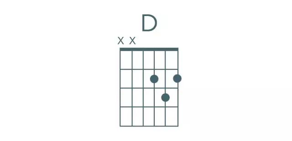
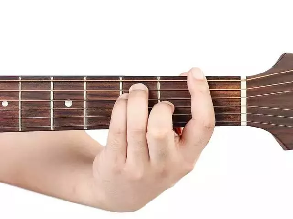
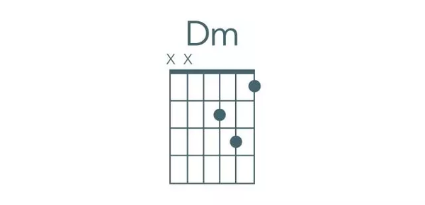
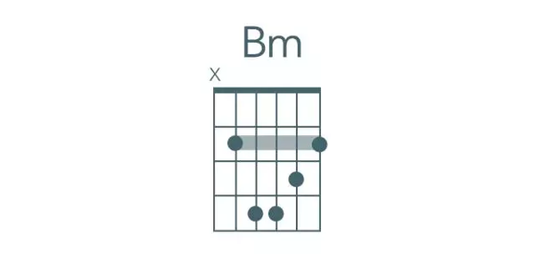
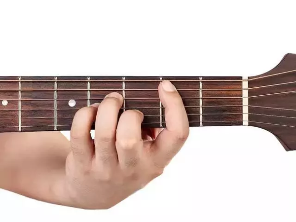
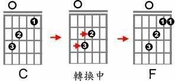

# 吉他学习

## 最常用的10个和弦

  
食指放在5弦的第二品上，中指放在4弦的第二品上, 或用中指放在5弦的第二品上，无名指放在4弦的第二品上

  
食指放在3弦的第二品上，中指放在1弦的第二品上，无名指放在2弦的第三品上

  
食指放在2弦的第一品上，中指放在4弦的第二品上，无名指放在5弦的第三品上

  
食指放在5弦的第二品上，中指放在6弦的第三品上，无名指放在1弦的第三品上, 或中指放在5弦的第二品上，无名指放在6弦的第三品上，小指放在1弦的第三品上

  
食指放在2弦的第一品上，中指放在4弦的第二品上，无名指放在3弦的第二品上

  
食指大横按在一品上，中指放在3弦的第二品上，无名指放在5弦第三品上，小指放在4弦第三品上  
  

  
食指指放在3弦的第一品上，中指放在5弦第二品上，无名指放在4弦第二品上

  
食指放在1弦第一品上，中指放在3弦第二品上，无名指放在2弦第三品上

  
食指放在4弦第二品上，中指放在3弦第二品上，无名指放在2弦第二品上

  
食指大横按放在第二品上，中指放在2弦第三品上，无名指放在4弦第四品上，小指放在3弦第四品上  

## 八个实用的吉他和弦转换技巧
1.压熟要转换的和絃，确保没有杂音
2.找出共通的手指

3.练习手指移动的速度，先从练习移动低音的手指开始

4.相同指型的手指可以一起移动

## 引用
https://www.zhihu.com/tardis/bd/ans/1797295715