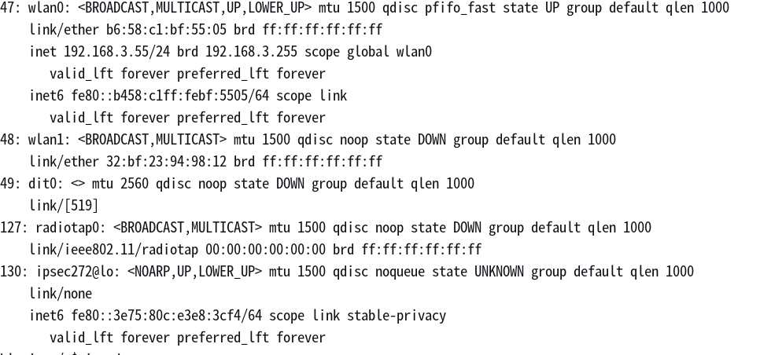
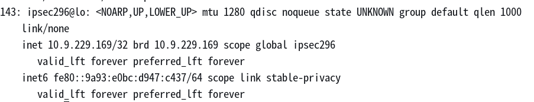
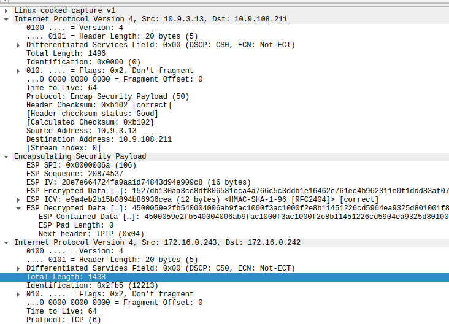

# ipsec 和 vowifi
记录了ipsec和vowifi的心得。

## ip 分片
当ip包长度大过MTU（以太网通常是1500）时，网卡（内核）会分成多个ip包发送。

## ipsec隧道的MTU
以太网的MTU都是1500, 但是因为ipsec带来的overhead, MTU会设置小一点避免路由二次分包。

### NAT模式，手机连接路由器, 真实vowifi场景
进入adb可以看到ipsec隧道ipsec272@lo 此时没有注册。  


手机注册vowifi成功后，获得了虚拟ip, 修改了ipsec隧道网卡的MTU。     



### 非NAT，tunnel模式
先了解ESP带来的消耗  


* 外层ip头总长度1496
* ESP SPI 字段长度4
* ESP Sequence 字段长度4
* ESP IV 长度16  AES-CBC
* ESP ICV 长度12 SHA1-96 
* ESP Pad 长度1 无padding
* ESP Next Header 长度1

ESP总共是38 byte。外层ip总长度(1496) - 内层ip总长度(1438) - 外层ip头(20)= 38 byte。 外层ip头+ESP一共是58。  
所以： 
1. 避免路由下一跳二次分包，需要预留空间给ipsec头。ipsec隧道网卡的MTU应该设置为1500 - 58 = 1442
2. 为了避免本地网卡分包，ip包的大小也应该小于MTU 1442。则:
   * TCP MSS = 1442 - ip头（20） - tcp头20 = 1402
   * UDP payload = 1442 - ip头（20） - udp头8 = 1414

## dpdk 
dpdk 支持 ipsec 的加解密，可以管理硬件加解密设备（智能网卡）和软件加解密设备（通用cpu上计算）。这里都是软件加解密，x86和arm上用不同的软件加解密库。

### advantages of RTE_SECURITY_ACTION_TYPE_CPU_CRYPTO over RTE_SECURITY_ACTION_TYPE_NONE
None模式的没走SECURITY的[api](https://mails.dpdk.org/archives/dev/2019-October/146846.html) , 要自己往队列里送op（operation）, 所以有 ipsec_process 和 drain 操作。 而cpu模式是串连到一起的。 没有送和收，直接调用加解密设备（软件/硬件）。

## tcp over ESP 分析小记
在排查网络问题时，不得不分析tcp报文，积累了一些知识：

1. wireshark中用方括号[]包起来的是wireshark分析提供的，而不是报文的字段。例如[TCP Retransmission]
2. wireshark中用用 tcp.seq = SEQ 和tcp.ack = SEQ+LEN 来定位发送和回复报文
3. TCP重发间隔，TCP的防庸塞，重传的间隔是变化的，第一次重传可能200ms, 第二次可能400ms, 第三次可能1600了，感觉是指数递增。
4. TCP重传间隔还跟ACK等待有关，ACK会晚一点回复，看是否有更多包过来，然后合并ACK。
5. TCP发送时，关键字段有SEQ和LEN, 分别表示数据偏移起点和数据长度。而ACK消息的ACK表示收到了多少字节数据，而且ACK总是累计值，就是全部收到，而不是部分收到。例如发送端发了两个报文SEQ=100/LEN=50, SEQ=150/LEN=50, 然后对端回复ACK=200，意思是两个报文都收到了。

### SACK(Selective ACK)
前面说了TCP的ACK总是累积的(cumulative)， 而当启用了SACK， 我遇到是默认启用了。如果第一个包没有收到，就收到第二个包和后面的包，会回复SACK包，SACK的关键信息如下
```
[TCP Dup ACK #NB1] SLE=NB2 SRE=NB3 
```
这表示接收端缺少了`SEQ=NB1, LEN`这个包，并收到了从NB2->NB3的包。接收端请求重发NB1包，并且不会丢弃NB2->NB3之间的包。

## 参考
[SLE/SRE](https://osqa-ask.wireshark.org/questions/1389/what-are-sre-and-sle/) 