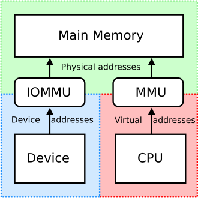

# pci passthrough
Linux中可以将硬件分配给虚拟机独占使用，或者给应用独占（dpdk），此时内核不负责该硬件。这涉及一系列东西（内核驱动卸载，vfio, iommu等）

## dpdk
对于支持vfio（支持或不支持iommu）的主机，dpdk或者宿主机可以绑定vfio驱动。除此之外dpdk还支持uio。

## sr-iov 基于硬件虚拟化
绑定vfio-pci驱动后，可以支持一些硬件offload功能

## IOMMU 是 DMA 的进化
当CPU要读取外设的数据时，发内存传输指令，由DMA执行，此时cpu可以做别的事情。而DMA是直接内存映射，需要连续的空间来支持大块的内存，而IOMMU则不需要，而且还能支持申请比系统寻址能力更大的内存，（例如32位只能支持4G， IOMMU能支持4G以上）。  
但IOMMU需要硬件支持的功能，intel vt-d 和 amd amd-vi支持iommu，但arm不支持。

## reference
https://pve.proxmox.com/wiki/PCI(e)_Passthrough
https://doc.dpdk.org/guides/linux_gsg/linux_drivers.html#vfio-noiommu
https://en.wikipedia.org/wiki/Input%E2%80%93output_memory_management_unit