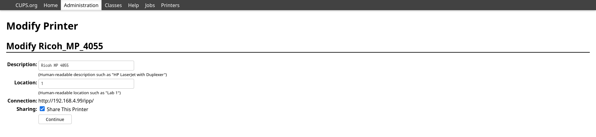

# 使用avahi将传统打印机支持无线打印

自从知道mdns之后，发现它非常方便，例如可以找到lan下有哪些ftp服务，ssh服务等。甚至我配置好的打印机服务。

## mdns介绍

有别于dns, mdns专门用来解析链路域名（TLD为*.local）， 且不需要域名服务器（nameserver）。   
原理是同一个lan里的主机通过avahi或zeroconfig类似的工具，向lan广播自己的ip信息和服务

## avahi 介绍

avahi是zeroconfig的开源实现，在linux下还有systemd-resolve 同样可以实现mdns解析，但是avahi依旧是linux预装的软件。

### avahi 配置

主要修改`/etc/avahi/avahi-daemon.conf`, 这里使用了br0和wlan0两个网卡，avahi就可以访问两个网络
```
use-ipv4=yes
allow-interfaces=br0,wlan0
```
再设置自启动

### nss 配置

要让主机能解析到*.local 域名，需要修改配置文件`/etc/nsswitch.conf` 
```diff
- hosts: files mymachines myhostname resolve [!UNAVAIL=return] dns
+ hosts: files mymachines myhostname mdns_minimal [NOTFOUND=return] resolve [!UNAVAIL=return] dns
```
这样，在主机请求解析域名的时候， 会先去请求avahi解析，如果avahi解析失败（说明不是一个local域名）才会去查找域名解析（dns）

## 使用systemd-resolved
对于使用systemd-resoved来管理dns解析时，可以直接用`sudo systemd-resolve --set-mdns=yes --interface=eth0`启动eth0端口的mdns广播。

顺便提一下，用systemd-networkd配置dns服务器和用systemd-resolved配置dns的区别，前者为每个以太网口单独配置，而systemd-resoved会读取每个以太网口配置，另外还有一个全局的dns配置。

### 测试

首先可以ping 本地local域名
```sh
~ > ping hst.local                                                                                                                                                                                      
PING hst.local(hst (fe80::3e9c:fff:fe8c:69c3%wlan0)) 56 data bytes
64 bytes from hst (fe80::3e9c:fff:fe8c:69c3%wlan0): icmp_seq=1 ttl=64 time=0.113 ms
64 bytes from hst (fe80::3e9c:fff:fe8c:69c3%wlan0): icmp_seq=2 ttl=64 time=0.144 ms
```

然后执行`avahi-discover-standalone` 可以查找到很多*.local的地址，特别是在公司网络里

## 广告自己的服务

配置好了avahi, 就可以向外界发布自己的服务，让其他人知道，也可以选择不发布  
例如要广告我的ssh服务, 只需要将预设的配置文件拷贝到avahi的配置目录下
```sh
sudo cp /usr/share/doc/avahi/ssh.service /etc/avahi/services
```
这样，别人就能发现我的ssh服务了

## 配置打印机

linux的打印功能依赖CUPS这个软件，先安装CUPS，设置自启动，然后就可以访问CUPS的网页版管理界面`http://localhost:631`  
在这个网页中添加网络打印机或者本地打印机，然后测试打印是否正常

## 最后，配置无线功能

上一部添加的打印机可能是有线网络打印机，也可能是串口打印机，都不能让我们的手机直接使用。  

但是通过cups + avahi 就可以将你的有线打印机变成无线打印机了  
首先在cups里配置，勾选`Share This Printer`， 


然后像刚才添加ssh服务一样， 添加打印服务  
在`/etc/avahi/services/` 创建一个service后缀的文件`airprint.service`

```xml
<?xml version="1.0" standalone='no'?><!--*-nxml-*-->
<!DOCTYPE service-group SYSTEM "avahi-service.dtd">
<service-group>
  <name>Printer</name>
  <service>
    <type>_ipp._tcp</type>
    <subtype>_universal._sub._ipp._tcp</subtype>
    <port>631</port>
    <txt-record>txtver=1</txt-record>
    <txt-record>qtotal=1</txt-record>
    <txt-record>rp=printers/Ricoh_MP_4055</txt-record>
    <txt-record>ty=Ricoh_MP_4055</txt-record>
    <txt-record>adminurl=http://yourip:631/printers/Ricoh_MP_4055</txt-record>
    <txt-record>note=Ricoh_MP_4055</txt-record>
    <txt-record>priority=0</txt-record>
    <txt-record>product=(GPL Ghostscript)</txt-record>
    <txt-record>printer-state=3</txt-record>
    <txt-record>printer-type=0x801046</txt-record>
    <txt-record>Transparent=T</txt-record>
    <txt-record>Binary=T</txt-record>
    <txt-record>Fax=F</txt-record>
    <txt-record>Color=T</txt-record>
    <txt-record>Duplex=T</txt-record>
    <txt-record>Staple=F</txt-record>
    <txt-record>Copies=T</txt-record>
    <txt-record>Collate=F</txt-record>
    <txt-record>Punch=F</txt-record>
    <txt-record>Bind=F</txt-record>
    <txt-record>Sort=F</txt-record>
    <txt-record>Scan=F</txt-record>
    <txt-record>pdl=application/octet-stream,application/pdf,application/postscript,image/jpeg,image/png,image/urf</txt-record>
    <txt-record>URF=W8,SRGB24,CP1,RS600</txt-record>
  </service>
</service-group>
```
根据情况修改一下内容，就完成了, 亲测iphone可以使用这个服务打印

## 注意

上面的情况假设防火墙处于关闭状态，如果启用防火墙的情况下，需要开放avahi、ssh以及ipp服务

```
sudo firewall-cmd --add-service ssh ipp --permanent
sudo firewall-cmd --add-port=5353/tcp --permanent
sudo firewall-cmd --reload
```


